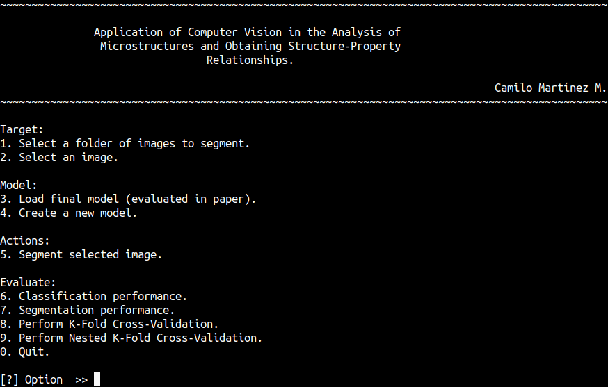
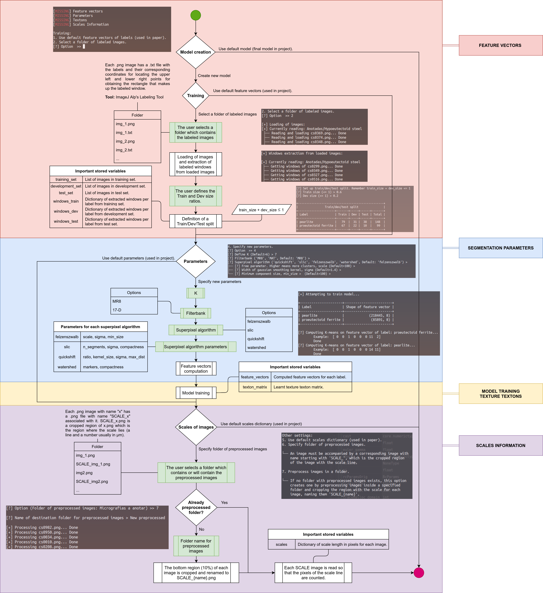

# Supervised Superpixel-Texton Approach for Micrograph Segmentation

**Version 1.0.0**

This repository holds the code and final model for the bachelor thesis titled "[Application of Computer Vision in the Analysis of Microstructures and Obtaining Structure-Property Relations](https://repositorio.uniandes.edu.co/entities/publication/60ccf854-b041-441b-b7f7-8a79662c4bc1)" (2021). This code requires Python 3.6 or newer.

# Project structure
- `model.py` does the "heavylifting", from the loading and pre-processing of images to the training and testing of a segmentation model and the post-processing of segmented micrographs (which include the estimation of the mean apparent interlaminar spacing of pearlite and the mechanical properties, based on that value and the volume fractions of the steel phases and morphologies present).
- `utils_classes.py` and `utils_functions.py` contain helper classes and functions, respectively.
- `app.py` is a console with the most important functions in `model.py`.

     
     
### Requirements
Refer to [requirements.txt](requirements.txt).

# Segmentation model

# Model selection tool
The console (`app.py`) includes an option to create a brand-new model for segmentation.
### Changeable parameters
- **Labeled images**: If the user has labeled images with the correct format, a folder of annotated images can be specified, thus creating a segmentation model for those classes and images, and not steel micrographs.
- **K**: Number of textons, i.e, number of clusters for *K-Means clustering*.
- **Superpixel-generation algorithm**: Possibilities include quickshift, slic, felzenszwalb and watershed. Depending on the chosen algorithm, the user can change the required parameters to specify.
### Flow diagram

# Notes
* `saved_variables/ground_truth.pickle` and `ground_truth_with_originals.pickle` were deleted because of space.
  
# License & copyright
© Camilo Martínez M., <ca.martinezm2@uniandes.edu.co>

Licensed under [GPL v3](LICENSE).
